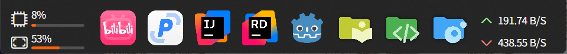

# DockBar

[](https://github.com/AvaloniaUI/Avalonia)


## 简介

个人目前在开发中的一个快捷方式停靠工具栏软件

可以停靠文件、文件夹和网站等，然后在点击停靠项目就可以快捷的打开它


## 如何使用

### 如何添加停靠项目

1. 从桌面、文件夹等文件系统拖入链接、程序、文件、文件夹等到停靠面板
2. 右键停靠面板打开菜单，点击 [在此添加新项目] 来打开添加面板添加停靠项目

### 如何编辑停靠项目

1. 右键停靠项目打开菜单，点击 [修改此项目] 来打开修改面板修改停靠项目

### 如何删除停靠项目

1. 右键停靠项目打开菜单，点击 [删除此项目] 来删除此停靠项目

### 如何移动停靠项目

1. 左键点击停靠项目不放，拖拽至想要的位置放开即可

## 源码使用

 
```sh
git clone https://github.com/AFunDog/DockBar.git
cd DockBar/src/DockBar.AvaloniaApp
dotnet publish -c Release -r win-x64 --self-contained true -p:PublishSingleFile=true -p:PublishReadyToRun=true -p:DebugSymbols=false -o ./publish --ucr false
```

在编译完成后，你能在仓库根目录`DockBar/DockBar.AvaloniaApp/publish`下看到生成完毕的文件，双击其中的`exe`文件即可运行